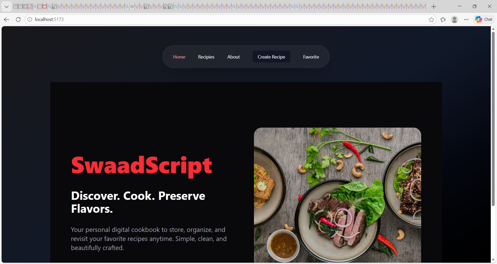
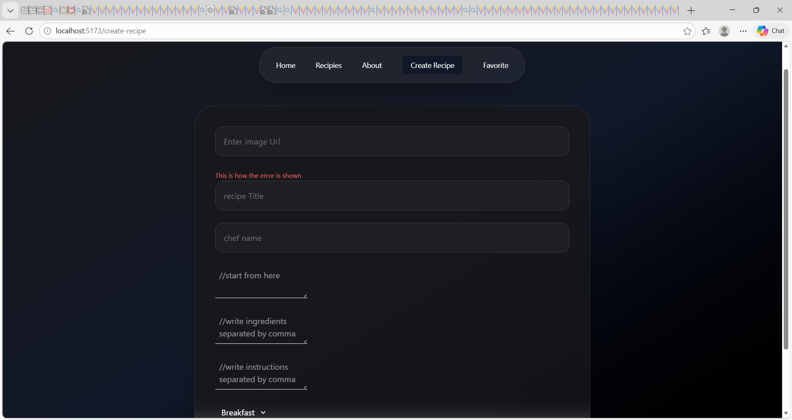
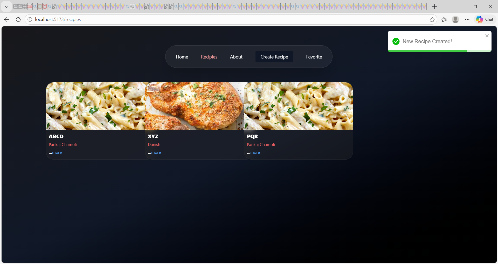
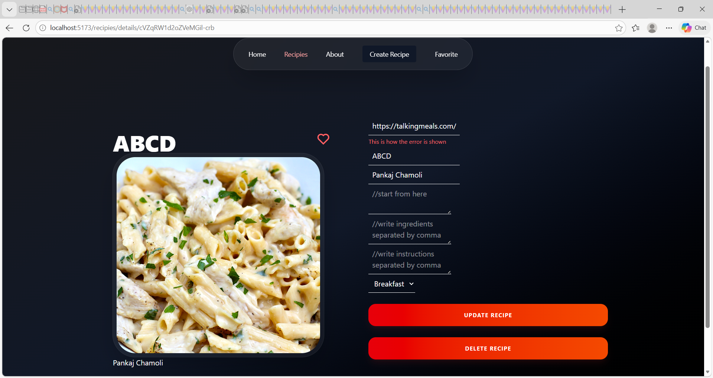
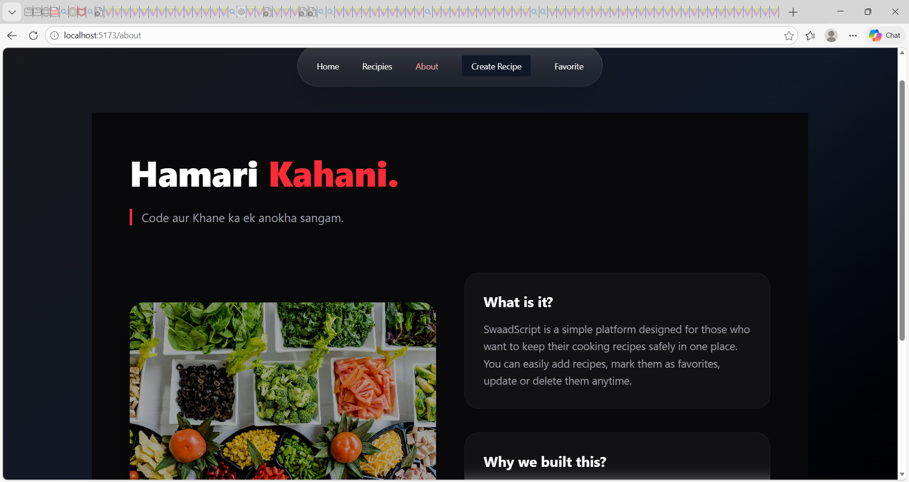

# 🍳 SwaadScript — Your Premium Digital Cookbook

SwaadScript is a modern, minimalist recipe management web application designed to help food lovers organize, store, and manage their recipes digitally.

---

## 🚀 Live Overview

A clean, fast and responsive digital cookbook built with React and Tailwind CSS.  
Store your favorite recipes, update them anytime, and never lose your delicious ideas again.

---

## 🌟 Key Features

- ✨ **Create Recipes** – Add your own custom recipes easily
- 📖 **View Recipes** – Browse all saved recipes
- ✏️ **Update Recipes** – Edit recipes anytime
- ❌ **Delete Recipes** – Remove unwanted recipes
- ❤️ **Favorites System** – Mark recipes as favorites
- 💾 **LocalStorage Support** – Data persists even after refresh
- 🎨 **Modern Dark UI** – Clean premium interface

---

## 🛠️ Tech Stack

- ⚛️ React.js (Vite)
- 🎨 Tailwind CSS
- 🧭 React Router DOM
- 🌍 React Context API
- 🎯 Remix Icons

---

## 📂 Project Structure

```bash
src/
│
├── components/
├── routes/
├── context/
├── App.jsx
└── main.jsx
```

---

## 📸 Screenshots

### 🏠 Home Page



### ➕ Create Recipe Page



### 📖 All Recipes Page



### ✏️ Update Recipe Page



### ℹ️ About Page



---

## 🚀 Installation & Setup

### 1️⃣ Clone the repository

```bash
git clone https://github.com/rudra-netizen/Recipe-App.git
cd Recipe-App
```

### 2️⃣ Install dependencies

```bash
npm install
```

### 3️⃣ Run development server

```bash
npm run dev
```

App will run on:

```
http://localhost:5173/
```

---

## 💡 Why SwaadScript?

We often lose recipes written on paper or saved randomly in notes.  
SwaadScript provides a simple and elegant digital solution to organize everything in one place.

---

## 🤝 Contributing

Pull requests are welcome.  
For major changes, please open an issue first to discuss what you would like to change.

---

## 📜 License

This project is open-source and available under the MIT License.

---

### ❤️ Made with passion for food lovers & developers.
